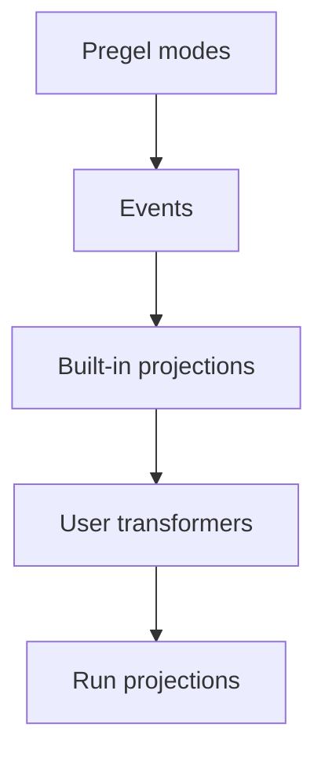

Stream transformers are the projection layer in Event Streaming. They observe protocol events, keep their own state, and expose derived views of a run such as messages, tool calls, subgraphs, tool activity, token totals, progress events, artifacts, or third-party protocol messages.

## How transformers work

Event Streaming starts with Pregel Streaming output from the LangGraph Pregel engine. The runtime normalizes those chunks into protocol events, then a stream handler routes each event through a stack of stream transformers.



The stream handler is the central dispatcher for one run. For every protocol event, it:

1. Calls each registered transformer's `process(event)` hook in order.
2. Wires named `StreamChannel` pushes back onto the protocol event stream.
3. Stores the event in the run stream unless a transformer suppresses it.
4. Calls `finalize()` or `fail()` on every transformer when the run ends.

Transformers are observational. They do not call back into the graph runtime. Instead, they consume events and push derived values into `StreamChannel`, promises, or other projection objects.

## User transformers


User transformers are the public extension point for Event Streaming. They let application or third-party code observe protocol events and expose derived data under `run.extensions.<name>`.


Use a user transformer when the built-in projections do not match the shape your application needs. For example, a transformer can publish tool activity, token totals, progress events, artifacts, or messages for another protocol.

## Transformer shape

A transformer implements the `StreamTransformer` interface:


```ts
interface StreamTransformer<TProjection = unknown> {
  init(): TProjection;
  process(event: ProtocolEvent): boolean;
  finalize?(): void | PromiseLike<void>;
  fail?(err: unknown): void;
}
```


- `init()` creates the projection object. User transformer projections appear under `run.extensions`.
- `process()` observes each protocol event. Return `false` only when you intentionally want to suppress the original event.
- `finalize()` closes or resolves non-channel projections after a successful run.
- `fail()` propagates errors to non-channel projections.

## Streaming projection

Use a named `StreamChannel` when a projection should be available both in process and over the wire:


```ts
import { StreamChannel } from "@langchain/langgraph";

const toolActivityTransformer = () => {
  const activity = StreamChannel.remote<{
    name: string;
    status: "started" | "finished" | "error";
  }>("toolActivity");

  return {
    init: () => ({ toolActivity: activity }),
    process(event) {
      if (event.method === "tools") {
        const data = event.params.data as { tool_name?: string; event?: string };
        if (data.tool_name && data.event) {
          activity.push({
            name: data.tool_name,
            status: data.event === "tool-error" ? "error" : "started",
          });
        }
      }
      return true;
    },
  };
};
```


In process, use `run.extensions` to access the projection:


```ts
const run = await graph.streamEvents(input, {
  version: "v3",
  transformers: [toolActivityTransformer],
});

for await (const item of run.extensions.toolActivity) {
  console.log(item);
}
```


For custom events emitted from graph nodes that should stay in process, use a local projection:


```ts
import { StreamChannel } from "@langchain/langgraph";

const customTransformer = () => {
  const custom = StreamChannel.local<unknown>();

  return {
    init: () => ({ custom }),
    process(event) {
      if (event.method === "custom") {
        custom.push(event.params.data);
      }
      return true;
    },
  };
};
```


Remote clients can consume named `StreamChannel` projections through `thread.extensions`:

```ts
const thread = client.threads.stream<Extensions>({
  assistantId: "simple-tool-with-metrics",
});

for await (const item of thread.extensions.toolActivity) {
  console.log(item);
}
```


## Final-value projection

Use local streams, promises, or other in-process objects when the projection should not cross the wire:


```ts
const statsTransformer = () => {
  let totalTokens = 0;
  let resolveTotal!: (value: number) => void;
  const totalTokensPromise = new Promise<number>((resolve) => {
    resolveTotal = resolve;
  });

  return {
    init: () => ({ totalTokens: totalTokensPromise }),
    process(event) {
      if (event.method === "messages") {
        const data = event.params.data as { usage?: { output_tokens?: number } };
        totalTokens += data.usage?.output_tokens ?? 0;
      }
      return true;
    },
    finalize: () => resolveTotal(totalTokens),
  };
};
```


## Compile-time and call-time transformers

Pass transformers at call time for local experimentation:


```ts
const run = await graph.streamEvents(input, {
  version: "v3",
  transformers: [statsTransformer, toolActivityTransformer],
});
```


Compile transformers into a graph when deployed clients should see them:


```ts
const graph = builder.compile({
  transformers: [statsTransformer, toolActivityTransformer],
});
```


Compile-time transformers can run server-side and expose named `StreamChannel` projections to SDK clients as `thread.extensions.<name>`.


## Type extensions

Use `InferExtensions` to reuse the in-process transformer type when consuming remote streams:

```ts
import type { InferExtensions } from "@langchain/langgraph";

type Extensions = InferExtensions<
  [typeof statsTransformer, typeof toolActivityTransformer]
>;

const thread = client.threads.stream<Extensions>({
  assistantId: "simple-tool-with-metrics",
});
```


See [StreamChannel](/oss/javascript/langgraph/streaming/streamchannel) for choosing local or remote projection visibility.

---

<div className="source-links">
<Callout icon="terminal-2">
    [Connect these docs](/use-these-docs) to Claude, VSCode, and more via MCP for real-time answers.
</Callout>
<Callout icon="edit">
    [Edit this page on GitHub](https://github.com/langchain-ai/docs/edit/main/src/oss/langgraph/streaming/custom-transformers.mdx) or [file an issue](https://github.com/langchain-ai/docs/issues/new/choose).
</Callout>
</div>
