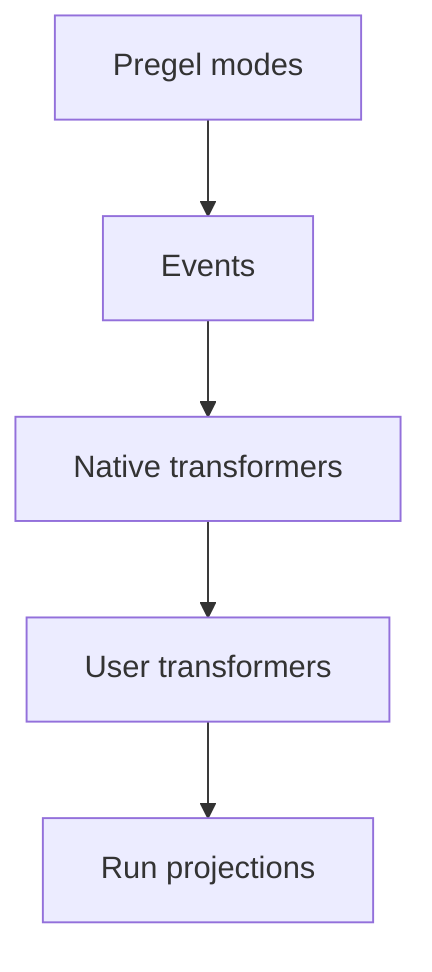

Stream transformers are the projection layer in Projection Streaming. They observe protocol events, keep their own state, and expose derived views of a run such as messages, tool calls, subgraphs, tool activity, token totals, progress events, artifacts, or third-party protocol messages.

## How transformers work

Projection Streaming starts with Mode Streaming output from the LangGraph Pregel engine. The runtime normalizes those chunks into protocol events, then a `StreamMux` routes each event through a stack of stream transformers.



The mux is the central dispatcher for one run. For every protocol event, it:

1. Calls each registered transformer's `process(event)` hook in order.
2. Wires `StreamChannel` pushes back onto the protocol event stream for remote clients.
3. Stores the event in the run event log unless a transformer suppresses it.
4. Calls `finalize()` or `fail()` on every transformer when the run ends.

Transformers are observational. They do not call back into the graph runtime. Instead, they consume events and push derived values into `EventLog`, `StreamChannel`, promises, or other projection objects.

## Native and user transformers

There are two kinds of stream transformers:

| Transformer type | Who provides it | Where the projection appears |
| ---------------- | --------------- | ---------------------------- |
| Native transformers | LangGraph, LangChain, or Deep Agents | First-class getters such as `run.values`, `run.messages`, `run.tool_calls`, or `run.subagents` |
| User transformers | Application or third-party code | `run.extensions.<name>` or `run.extensions["name"]` |

Native and user transformers use the same contract and run in the same mux pipeline. Product layers add native transformers first: LangGraph adds graph projections, LangChain agents add tool-call projections, and Deep Agents add subagent projections. User transformers are stacked on top through compile-time or call-time registration.

Use a user transformer when the built-in projections do not match the shape your application needs.

## Transformer shape

A transformer implements the `StreamTransformer` interface:

:::python
```py
from langgraph.stream import ProtocolEvent, StreamTransformer


class MyTransformer(StreamTransformer):
    def init(self) -> dict:
        ...

    def process(self, event: ProtocolEvent) -> bool:
        ...

    def finalize(self) -> None:
        ...

    def fail(self, err: BaseException) -> None:
        ...
```
:::

:::js
```ts
interface StreamTransformer<TProjection = unknown> {
  init(): TProjection;
  process(event: ProtocolEvent): boolean;
  finalize?(): void | PromiseLike<void>;
  fail?(err: unknown): void;
}
```
:::

- `init()` creates the projection object. User transformer projections appear under `run.extensions`; native transformer projections can be promoted to first-class run getters.
- `process()` observes each protocol event. Return `false` only when you intentionally want to suppress the original event.
- `finalize()` closes or resolves non-channel projections after a successful run.
- `fail()` propagates errors to non-channel projections.

## Streaming projection

Use `StreamChannel` when remote clients should be able to consume the projection:

:::python
```py
from typing import TypedDict

from langgraph.stream import ProtocolEvent, StreamChannel, StreamTransformer


class ToolActivity(TypedDict):
    name: str
    status: str


class ToolActivityTransformer(StreamTransformer):
    required_stream_modes = ("tools",)

    def __init__(self, scope: tuple[str, ...] = ()) -> None:
        super().__init__(scope)
        self.activity = StreamChannel[ToolActivity]("tool_activity")

    def init(self) -> dict:
        return {"tool_activity": self.activity}

    def process(self, event: ProtocolEvent) -> bool:
        if event["method"] != "tools":
            return True

        data = event["params"]["data"]
        if isinstance(data, dict) and data.get("tool_name") and data.get("event"):
            status = "error" if data["event"] == "tool-error" else "started"
            self.activity.push({"name": data["tool_name"], "status": status})
        return True
```
:::

:::js
```ts
import { StreamChannel } from "@langchain/langgraph";

const toolActivityTransformer = () => {
  const activity = new StreamChannel<{
    name: string;
    status: "started" | "finished" | "error";
  }>("toolActivity");

  return {
    init: () => ({ toolActivity: activity }),
    process(event) {
      if (event.method === "tools") {
        const data = event.params.data as { tool_name?: string; event?: string };
        if (data.tool_name && data.event) {
          activity.push({
            name: data.tool_name,
            status: data.event === "tool-error" ? "error" : "started",
          });
        }
      }
      return true;
    },
  };
};
```
:::

In process, use `run.extensions` to access the projection:

:::python
```py
run = graph.stream_v2(
    input,
    transformers=[ToolActivityTransformer],
)

for item in run.extensions["tool_activity"]:
    print(item)
```
:::

:::js
```ts
const run = await graph.stream_v2(input, {
  transformers: [toolActivityTransformer],
});

for await (const item of run.extensions.toolActivity) {
  console.log(item);
}
```
:::

For custom events emitted from graph nodes, back the projection with `EventLog`:

:::python
```py
from langgraph.config import get_stream_writer
from langgraph.stream import EventLog, ProtocolEvent, StreamTransformer


def node(state):
    writer = get_stream_writer()
    writer({"kind": "progress", "message": "retrieving context"})
    return state


class CustomTransformer(StreamTransformer):
    required_stream_modes = ("custom",)

    def __init__(self, scope: tuple[str, ...] = ()) -> None:
        super().__init__(scope)
        self.log = EventLog()

    def init(self) -> dict:
        return {"custom": self.log}

    def process(self, event: ProtocolEvent) -> bool:
        if event["method"] == "custom":
            self.log.push(event["params"]["data"])
        return True


run = graph.stream_v2(input, transformers=[CustomTransformer])

for item in run.extensions["custom"]:
    print(item)
```
:::

:::js
Remote clients can consume the same projection through `thread.extensions`:

```ts
const thread = client.threads.stream<Extensions>({
  assistantId: "simple-tool-with-metrics",
});

for await (const item of thread.extensions.toolActivity) {
  console.log(item);
}
```
:::

## Final-value projection

Use `EventLog`, promises, or other in-process objects when the projection is not intended for remote clients:

:::python
```py
from langgraph.stream import EventLog, ProtocolEvent, StreamTransformer


class StatsTransformer(StreamTransformer):
    required_stream_modes = ("messages",)

    def __init__(self, scope: tuple[str, ...] = ()) -> None:
        super().__init__(scope)
        self.total_tokens = 0
        self.total_tokens_log = EventLog[int]()

    def init(self) -> dict:
        return {"total_tokens": self.total_tokens_log}

    def process(self, event: ProtocolEvent) -> bool:
        data = event["params"]["data"]
        if isinstance(data, dict):
            usage = data.get("usage") or {}
            self.total_tokens += usage.get("output_tokens") or 0
        return True

    def finalize(self) -> None:
        self.total_tokens_log.push(self.total_tokens)
        self.total_tokens_log.close()
```
:::

:::js
```ts
const statsTransformer = () => {
  let totalTokens = 0;
  let resolveTotal!: (value: number) => void;
  const totalTokensPromise = new Promise<number>((resolve) => {
    resolveTotal = resolve;
  });

  return {
    init: () => ({ totalTokens: totalTokensPromise }),
    process(event) {
      if (event.method === "messages") {
        const data = event.params.data as { usage?: { output_tokens?: number } };
        totalTokens += data.usage?.output_tokens ?? 0;
      }
      return true;
    },
    finalize: () => resolveTotal(totalTokens),
  };
};
```
:::

## Compile-time and call-time transformers

Pass transformers at call time for local experimentation:

:::python
```py
run = graph.stream_v2(
    input,
    transformers=[StatsTransformer, ToolActivityTransformer],
)
```
:::

:::js
```ts
const run = await graph.stream_v2(input, {
  transformers: [statsTransformer, toolActivityTransformer],
});
```
:::

Compile transformers into a graph when deployed clients should see them:

:::python
```py
graph = builder.compile(
    transformers=[StatsTransformer, ToolActivityTransformer],
)
```
:::

:::js
```ts
const graph = builder.compile({
  transformers: [statsTransformer, toolActivityTransformer],
});
```
:::

Compile-time transformers can run server-side and expose `StreamChannel` projections to SDK clients as `thread.extensions.<name>`.

:::python
`create_agent` registers the built-in tool-call transformer for you, which is why agents expose `run.tool_calls`. On a plain `StateGraph`, opt in when you want the same projection:

```py
from langgraph.prebuilt import ToolCallTransformer

run = graph.stream_v2(input, transformers=[ToolCallTransformer])

for tool_call in run.tool_calls:
    print(tool_call.tool_name, tool_call.input)
```
:::

:::js
## Type extensions

Use `InferExtensions` to reuse the in-process transformer type when consuming remote streams:

```ts
import type { InferExtensions } from "@langchain/langgraph";

type Extensions = InferExtensions<
  [typeof statsTransformer, typeof toolActivityTransformer]
>;

const thread = client.threads.stream<Extensions>({
  assistantId: "simple-tool-with-metrics",
});
```
:::

See [EventLog and StreamChannel](/oss/langgraph/streaming/event-log-and-stream-channel) for choosing the right projection primitive.
