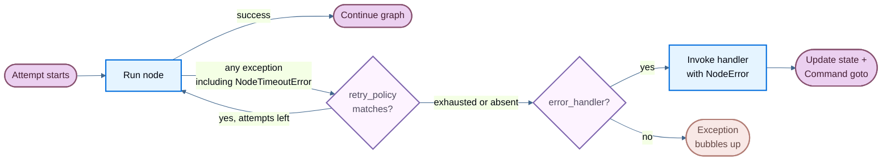

:::python

LangGraph provides three composable mechanisms for handling node failures:

1. **Timeouts** cap how long a single node attempt may run (`timeout=`).
2. **Retry policies** automatically re-run failed attempts based on exception type and backoff settings (`retry_policy=`).
3. **Error handlers** run a recovery function after all retries are exhausted (`error_handler=`).

<Note>
Per-node timeouts and node-level error handlers require `langgraph>=1.2`.
</Note>

These compose in a fixed order: when a node attempt fails with any exception (including @[`NodeTimeoutError`] from a timeout), the retry policy decides whether to retry, and only after retries are exhausted does the error handler fire.



## Retry policies recap

A retry policy automatically re-runs a failed node attempt based on exception type and backoff settings. Pass `retry_policy=` to @[`add_node`]:

```python
from langgraph.types import RetryPolicy

builder.add_node(
    "call_api",
    call_api,
    retry_policy=RetryPolicy(max_attempts=3),
)
```

By default, the `retry_on` parameter uses `default_retry_on`, which retries on **any** exception except the following (and their subclasses):

- `ValueError`
- `TypeError`
- `ArithmeticError`
- `ImportError`
- `LookupError`
- `NameError`
- `SyntaxError`
- `RuntimeError`
- `ReferenceError`
- `StopIteration`
- `StopAsyncIteration`
- `OSError`

For exceptions from popular HTTP libraries such as `requests` and `httpx`, it only retries on 5xx status codes. `NodeTimeoutError` is retryable by default.

To customize which exceptions are retried, pass a callable or exception type to `retry_on`. You can also import `default_retry_on` and extend it:

```python
from langgraph.types import RetryPolicy, default_retry_on

def custom_retry_on(exc: BaseException) -> bool:
    if isinstance(exc, MyCustomError):
        return False
    return default_retry_on(exc)

builder.add_node(
    "call_api",
    call_api,
    retry_policy=RetryPolicy(max_attempts=3, retry_on=custom_retry_on),
)
```

See [Add retry policies](/oss/langgraph/use-graph-api#add-retry-policies) for the full retry API, including `initial_interval` and `backoff_factor`.

## Configure a node timeout

The `timeout=` parameter on @[`add_node`] caps how long a single node attempt may run. When the limit is exceeded, LangGraph raises @[`NodeTimeoutError`], clears any writes from the failed attempt, and lets the retry policy decide whether to retry.

Pass a number (seconds), a `timedelta`, or a @[`TimeoutPolicy`] for finer control:

```python
from datetime import timedelta
from langgraph.types import TimeoutPolicy

builder.add_node("call_model", call_model, timeout=60)

builder.add_node("call_model", call_model, timeout=timedelta(minutes=2))

builder.add_node(
    "call_model",
    call_model,
    timeout=TimeoutPolicy(
        run_timeout=120,
        idle_timeout=30,
        refresh_on="auto",
    ),
)
```

### `run_timeout` vs `idle_timeout`

@[`TimeoutPolicy`] supports two complementary limits:

- **`run_timeout`** is a hard wall-clock cap on a single attempt. It is never refreshed, regardless of progress.
- **`idle_timeout`** is a progress-resetting cap. It fires only when the node stops making observable progress for the specified duration.

You can set either or both. When both are set, whichever fires first cancels the attempt.

### What refreshes the idle clock

Under the default `refresh_on="auto"`, the idle timer resets whenever the node produces observable progress:

- State writes via `CONFIG_KEY_SEND`
- Stream output (yielded async stream chunks)
- Child-task scheduling
- Runtime stream-writer calls
- Any LangChain callback event from descendants of the node's run (LLM tokens, tool calls, chain start/end, etc.)

Set `refresh_on="heartbeat"` to narrow the refresh source to explicit `runtime.heartbeat()` calls only. This is useful when you want a strict idle definition that isn't reset by chatty subordinates.

### Manual progress with `runtime.heartbeat()`

For long-running async work that doesn't naturally emit any of the progress signals above, call `runtime.heartbeat()` to manually reset the idle timer:

```python
from langgraph.graph import StateGraph, START, END
from langgraph.runtime import Runtime
from langgraph.types import TimeoutPolicy
from typing_extensions import TypedDict

class State(TypedDict):
    result: str

async def long_running_node(state: State, runtime: Runtime) -> State:
    for batch in fetch_batches():
        process(batch)
        runtime.heartbeat()  # [!code highlight]
    return {"result": "done"}

builder = StateGraph(State)
builder.add_node(
    "long_running_node",
    long_running_node,
    timeout=TimeoutPolicy(idle_timeout=30, refresh_on="heartbeat"),
)
builder.add_edge(START, "long_running_node")
builder.add_edge("long_running_node", END)
```

`runtime.heartbeat()` is a no-op outside an idle-timed attempt, so you can call it unconditionally.

### Timeouts compose with retries

The default retry policy retries `NodeTimeoutError`, so combining `timeout=` with `retry_policy=` works out of the box:

```python
from langgraph.types import RetryPolicy, TimeoutPolicy

builder.add_node(
    "call_model",
    call_model,
    timeout=TimeoutPolicy(idle_timeout=30),
    retry_policy=RetryPolicy(max_attempts=3),
)
```

The timeout timer resets on each new attempt. Writes from a timed-out attempt are cleared so they don't leak into the checkpoint after a successful retry.

### `NodeTimeoutError`

@[`NodeTimeoutError`] carries structured context about the timeout that fired:

| Attribute | Type | Description |
| --------- | ---- | ----------- |
| `node` | `str` | Name of the node whose execution timed out. |
| `elapsed` | `float` | Seconds elapsed before the timeout fired. |
| `kind` | `Literal["idle", "run"]` | Which timeout fired. |
| `idle_timeout` | `float \| None` | The configured idle timeout (seconds), if any. |
| `run_timeout` | `float \| None` | The configured run timeout (seconds), if any. |

<Warning>
Node timeouts only apply to **async** nodes. Sync Python code cannot be safely cancelled in-process, so LangGraph rejects sync nodes with a `timeout` at compile time. If you need to wrap blocking I/O, use `asyncio.to_thread` inside an async node.
</Warning>

## Add an error handler

An error handler is a function that runs after a node fails and all retries are exhausted. It receives the current state and can update it or route to a different node using @[`Command`]. This is useful for compensation flows (e.g., Saga patterns) where you want to recover gracefully rather than abort the entire graph.

Pass `error_handler=` to @[`add_node`]:

```python
from langgraph.errors import NodeError
from langgraph.types import Command, RetryPolicy
from langgraph.graph import StateGraph, START
from typing_extensions import TypedDict

class State(TypedDict):
    status: str

def charge_payment(state: State) -> State:
    raise RuntimeError("payment gateway timeout")

def payment_error_handler(state: State, error: NodeError) -> Command:
    return Command(
        update={"status": f"compensated: {error.error}"},
        goto="finalize",
    )

def finalize(state: State) -> State:
    return state

graph = (
    StateGraph(State)
    .add_node("charge_payment", charge_payment,
              retry_policy=RetryPolicy(max_attempts=3, retry_on=ConnectionError),
              error_handler=payment_error_handler)
    .add_node("finalize", finalize)
    .add_edge(START, "charge_payment")
    .compile()
)
```

The handler fires only after `retry_policy` is exhausted (or immediately if no retry policy is configured). The retry policy and the error handler stay decoupled: you configure when to retry and when to compensate independently.

### The `NodeError` parameter

Error handlers receive failure context through a typed `error: NodeError` parameter, injected by type annotation (the same pattern as `runtime: Runtime`):

```python
from langgraph.errors import NodeError

def my_handler(state: State, error: NodeError) -> Command:
    print(f"Node {error.node} failed with: {error.error}")
    return Command(update={"status": "recovered"}, goto="next_step")
```

@[`NodeError`] is a frozen dataclass with two fields:

| Attribute | Type | Description |
| --------- | ---- | ----------- |
| `node` | `str` | Name of the node whose execution failed. |
| `error` | `BaseException` | The exception raised by the failed node. |

The `error: NodeError` parameter is **opt-in**. Handlers that don't need failure context can use simpler signatures like `(state)` or `(state, runtime)`.

### Route to a recovery branch with `Command`

Error handlers can return a @[`Command`] to update state and route to a specific node, enabling Saga / compensation patterns:

```python
from langgraph.errors import NodeError
from langgraph.types import Command, RetryPolicy
from langgraph.graph import StateGraph, START
from typing_extensions import TypedDict

class State(TypedDict):
    status: str

def reserve_inventory(state: State) -> State:
    return {"status": "reserved"}

def charge_payment(state: State) -> State:
    raise RuntimeError("payment timeout")

def payment_error_handler(state: State, error: NodeError) -> Command:
    return Command(
        update={"status": f"compensated_after_{error.node}: {error.error}"},
        goto="finalize",
    )

def finalize(state: State) -> State:
    return state

graph = (
    StateGraph(State)
    .add_node("reserve_inventory", reserve_inventory)
    .add_node(
        "charge_payment",
        charge_payment,
        retry_policy=RetryPolicy(max_attempts=3, retry_on=ConnectionError),
        error_handler=payment_error_handler,
    )
    .add_node("finalize", finalize)
    .add_edge(START, "reserve_inventory")
    .add_edge("reserve_inventory", "charge_payment")
    .compile()
)
```

In this Saga pattern, `charge_payment` retries on `ConnectionError` up to 3 times. If the error is not a `ConnectionError` (or retries are exhausted), the handler compensates by updating state and routing to `finalize` instead of aborting the graph.

### Resume-safe failures

<Note>
Failure provenance is checkpointed. If the graph is interrupted or the process crashes after a node fails but before the handler completes, the handler sees the same `NodeError` context when the graph resumes from its checkpoint.
</Note>

### Interaction with `interrupt()`

<Warning>
`interrupt()` raised inside a node is **not** routed to the error handler. Interrupts use the `GraphBubbleUp` mechanism to pause graph execution for human-in-the-loop workflows, and they bypass both retry policies and error handlers. The graph pauses as usual.
</Warning>

### Subgraph failures

If a node wraps a subgraph and the subgraph raises an unhandled exception, that exception surfaces to the parent node. If the parent node has an `error_handler`, the handler fires with the subgraph's exception in `error.error`.

## Functional API: `@task` and `@entrypoint` timeouts

The same `timeout=` parameter is available on `@task` and `@entrypoint` in the functional API:

```python
from langgraph.func import entrypoint, task
from langgraph.types import TimeoutPolicy

@task(timeout=TimeoutPolicy(idle_timeout=30))
async def call_api(url: str) -> str:
    response = await fetch(url)
    return response.text

@entrypoint(timeout=60)
async def my_workflow(inputs: dict) -> str:
    result = await call_api("https://api.example.com/data")
    return result
```

The behavior is identical to `add_node`: `NodeTimeoutError` is raised on timeout, buffered writes are cleared, and the retry policy (if configured) decides whether to retry.

## Limitations

- **Python only**: neither timeouts nor error handlers are available in the JavaScript/TypeScript SDK yet.
- **Timeouts are async-only**: sync nodes with a `timeout` are rejected at compile time.
- **One handler per node**: each node can have at most one `error_handler`.
- **Handler failures bubble up**: if the error handler itself raises an exception, that exception propagates as if the node had no handler.


:::
